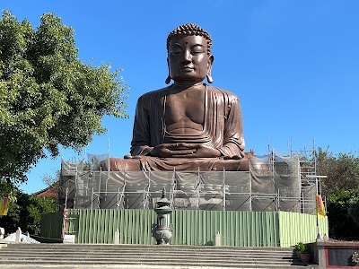
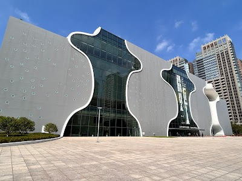
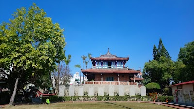
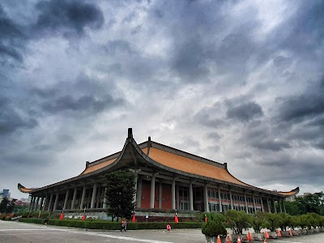
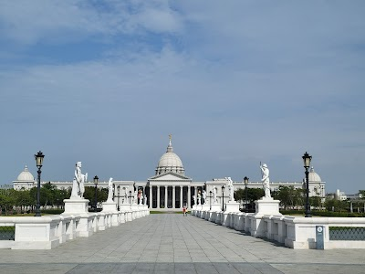
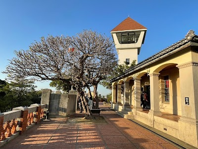
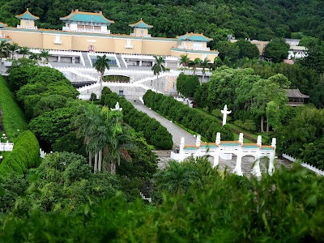
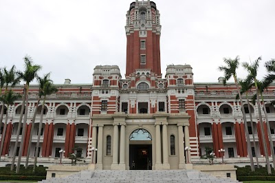

## Image: 中正紀念堂.jpg

### Question: 請問圖片中是台灣哪一個景點

Answer: <|begin_of_text|><|start_header_id|>user<|end_header_id|>

<|image|>請問圖片中是台灣哪一個景點<|eot_id|><|start_header_id|>assistant<|end_header_id|>

這是台灣的國父紀念館，位於台北市中正區，距離國父故居不遠。國父紀念館是紀念孫中山的重要場所，內有孫中山的遺體和他所著的著作等文物。<|eot_id|>

### Question: 請問圖片中是哪一個景點

Answer: <|begin_of_text|><|start_header_id|>user<|end_header_id|>

<|image|>請問圖片中是哪一個景點<|eot_id|><|start_header_id|>assistant<|end_header_id|>

這是台灣台北市的景點，名為「忠烈祠」。忠烈祠是紀念國父孫中山的紀念建築，內有孫中山的陵墓及相關紀念設施，外觀設計為中國傳統宮殿式建築，內部則有多項展覽與紀念設施，包括孫中山的陵墓、紀念館、展覽館、紀念碑

---

## Image: 八卦山大佛.jpg

### Question: 請問圖片中是台灣哪一個景點

Answer: <|begin_of_text|><|start_header_id|>user<|end_header_id|>

<|image|>請問圖片中是台灣哪一個景點<|eot_id|><|start_header_id|>assistant<|end_header_id|>

這是大佛，位於台灣台北的金山寺，金山寺的正式名稱是「大華嚴寺」，又稱「金山大佛」，是台北金山區的佛寺，於1996年落成。金山大佛是台北金山區的一座佛教寺廟，於1996年落成，為世界第二高的坐佛像。金山大佛的高度達到79.6公尺

### Question: 請問圖片中是哪一個景點

Answer: <|begin_of_text|><|start_header_id|>user<|end_header_id|>

<|image|>請問圖片中是哪一個景點<|eot_id|><|start_header_id|>assistant<|end_header_id|>

這是大佛禪寺位於香港大嶼山的景點。<|eot_id|>

---

## Image: 台中國家歌劇院.jpg

### Question: 請問圖片中是台灣哪一個景點

Answer: <|begin_of_text|><|start_header_id|>user<|end_header_id|>

<|image|>請問圖片中是台灣哪一個景點<|eot_id|><|start_header_id|>assistant<|end_header_id|>

圖片中顯示的建築物是「國家海洋博物館」(National Kaohsiung Center for the Arts)。它是一座位於台灣高雄市的文化藝術中心，於2016年開幕。博物館內設有多個展覽空間，展示了許多海洋生物和海洋文化的展覽。<|eot_id|>

### Question: 請問圖片中是哪一個景點

Answer: <|begin_of_text|><|start_header_id|>user<|end_header_id|>

<|image|>請問圖片中是哪一個景點<|eot_id|><|start_header_id|>assistant<|end_header_id|>

這是香港西九龍文化區的海濱藝術館。海濱藝術館是一個綜合性的藝術中心，提供多種藝術表演形式，包括戲劇、音樂、舞蹈、攝影、視覺藝術等。館內設有多間藝術室，供藝術家舉辦個展、交流、創作。館內還設有多間演藝廳、音樂廳等，舉

---

## Image: 台北101.jpg

### Question: 請問圖片中是台灣哪一個景點

Answer: <|begin_of_text|><|start_header_id|>user<|end_header_id|>

<|image|>請問圖片中是台灣哪一個景點<|eot_id|><|start_header_id|>assistant<|end_header_id|>

圖片中所呈現的景點是台北101，台北101是一座位於台灣台北市的超高層摩天大樓，為世界第六高樓。其高度為508公尺（1,667英尺），於2004年開工，2004年8月完成主樑，2004年10月開放觀景台。2007年1月31日正式開幕，創下世界第一高的建築。<|eot_id|>

### Question: 請問圖片中是哪一個景點

Answer: <|begin_of_text|><|start_header_id|>user<|end_header_id|>

<|image|>請問圖片中是哪一個景點<|eot_id|><|start_header_id|>assistant<|end_header_id|>

圖片中顯示的景點是位於台灣台北市的101大樓，也就是台北101大樓。它是世界上最高的摩天大樓，於2004年開工，於2004年10月31日正式啟用。這座建築以其獨特的設計，結合傳統的中國元素和現代的建築技術，成為了台灣的一個象徵性建築。<|eot_id|>

---

## Image: 台南赤崁樓.jpg

### Question: 請問圖片中是台灣哪一個景點

Answer: <|begin_of_text|><|start_header_id|>user<|end_header_id|>

<|image|>請問圖片中是台灣哪一個景點<|eot_id|><|start_header_id|>assistant<|end_header_id|>

這是一個位於墨西哥城的景點，名為「墨西哥台灣文化中心」(Centro Cultural Chino Taipéi)。這個景點是由墨西哥和台灣共同建設，於1992年落成。它是墨西哥最大的中國式建築之一，內部設有多個展覽館，展出台灣的藝術文化和歷史。<|eot_id|>

### Question: 請問圖片中是哪一個景點

Answer: <|begin_of_text|><|start_header_id|>user<|end_header_id|>

<|image|>請問圖片中是哪一個景點<|eot_id|><|start_header_id|>assistant<|end_header_id|>

圖片中所呈現的景點是聖地牙哥中國城的「華美園林」(Lincoln Park Chinese Garden)，是美國加州最大的華美園林之一，位於聖地牙哥的中國城區內。園林佔地1.7公頃，內有多個亭子、亭子上的裝飾、花園、亭子內的壁畫等。園林內還有許多藝術品，包括

---

## Image: 國父紀念館.jpg

### Question: 請問圖片中是台灣哪一個景點

Answer: <|begin_of_text|><|start_header_id|>user<|end_header_id|>

<|image|>請問圖片中是台灣哪一個景點<|eot_id|><|start_header_id|>assistant<|end_header_id|>

圖片中顯示的景點是國立故宮博物院。國立故宮博物院是臺灣最大的博物館，也是全世界最大的漢藏藝術博物館之一。故宮博物院的前身是清朝末年皇室的藏品，當時被稱為「故宮」，後來在1925年被運往北京。二戰結束後，故宮藏品被運回臺灣，後來在1955

### Question: 請問圖片中是哪一個景點

Answer: <|begin_of_text|><|start_header_id|>user<|end_header_id|>

<|image|>請問圖片中是哪一個景點<|eot_id|><|start_header_id|>assistant<|end_header_id|>

圖片中顯示的景點是台灣國立故宮博物院。國立故宮博物院位於台北市中正區，原為清朝皇室的故宮，於1949年中華民國政府遷台後改為博物院。故宮博物院以收藏中國古代文物著稱，館內有各類文物超過一百萬件。<|eot_id|>

---

## Image: 奇美博物館.jpg

### Question: 請問圖片中是台灣哪一個景點

Answer: <|begin_of_text|><|start_header_id|>user<|end_header_id|>

<|image|>請問圖片中是台灣哪一個景點<|eot_id|><|start_header_id|>assistant<|end_header_id|>

這個景點是位於台灣台中市的「陽明山水園區」,也就是陽明山水園,或稱為陽明公園。陽明山水園區是一個綜合性休閒設施，包含自然風景、人工水景、古蹟等多元的景點。陽明山水園區內的主要景點有陽明山水園區、陽明公園、陽明山水

### Question: 請問圖片中是哪一個景點

Answer: <|begin_of_text|><|start_header_id|>user<|end_header_id|>

<|image|>請問圖片中是哪一個景點<|eot_id|><|start_header_id|>assistant<|end_header_id|>

這個景點是位於台灣台中市的台中公園。它是台中市的代表性景點之一，建於1903年，是一座面積達2,000餘公頃的公園，內有多個景點。其中，「水池廣場」是這個景點的代表性建築之一，內有許多藝術雕塑。<|eot_id|>

---

## Image: 安平古堡.jpg

### Question: 請問圖片中是台灣哪一個景點

Answer: <|begin_of_text|><|start_header_id|>user<|end_header_id|>

<|image|>請問圖片中是台灣哪一個景點<|eot_id|><|start_header_id|>assistant<|end_header_id|>

根據圖片中所看到的景點，該景點是位於台灣新北市的金山水族館。金山水族館是一個位於新北市金山區的水族館，佔地約 3,000 平方公尺，內有許多不同種類的海洋生物，包括魚類、海龜、海豚等。水族館內還設有多個展覽館，展示各種不同的海

### Question: 請問圖片中是哪一個景點

Answer: <|begin_of_text|><|start_header_id|>user<|end_header_id|>

<|image|>請問圖片中是哪一個景點<|eot_id|><|start_header_id|>assistant<|end_header_id|>

該景點是位於台南市安平區的安平古堡, 位於台南市安平海防城遺址, 是一座歷史悠久的古堡, 建於清代, 曾經是清朝政府在台灣設立的海防城, 現在是一座博物館, 展示了清代的歷史文物和建築, 是台南市的重要觀光景點之一.<|eot_id|>

---

## Image: 故宮.jpg

### Question: 請問圖片中是台灣哪一個景點

Answer: <|begin_of_text|><|start_header_id|>user<|end_header_id|>

<|image|>請問圖片中是台灣哪一個景點<|eot_id|><|start_header_id|>assistant<|end_header_id|>

圖片中顯示的是「天主教聖母聖殿」，又稱天主教台北總教區聖母聖殿、聖母聖殿，位於台灣新北市汐止區，是天主教台北總教區的主教座堂，也是台灣唯一一座天主教主教座堂。該堂位於新北市汐止區中正路與仁愛路口，毗鄰汐止公園，與�

### Question: 請問圖片中是哪一個景點

Answer: <|begin_of_text|><|start_header_id|>user<|end_header_id|>

<|image|>請問圖片中是哪一個景點<|eot_id|><|start_header_id|>assistant<|end_header_id|>

這個景點是位於臺灣臺北縣金山區的景點。<|eot_id|>

---

## Image: 總統府.jpg

### Question: 請問圖片中是台灣哪一個景點

Answer: <|begin_of_text|><|start_header_id|>user<|end_header_id|>

<|image|>請問圖片中是台灣哪一個景點<|eot_id|><|start_header_id|>assistant<|end_header_id|>

根據圖片的樣貌，我們可以推測這是台灣的國立故宮博物院。國立故宮博物院位於台北市的台北市信義區，於1925年由日治時期的台灣總督府所設立。其建築風格為巴洛克風格，內部擁有豐富的文物收藏，包括陶瓷、漆器、木雕、玉石等等。

### Question: 請問圖片中是哪一個景點

Answer: <|begin_of_text|><|start_header_id|>user<|end_header_id|>

<|image|>請問圖片中是哪一個景點<|eot_id|><|start_header_id|>assistant<|end_header_id|>

圖片中顯示的是台北市政府新廳的正門。<|eot_id|>

---

