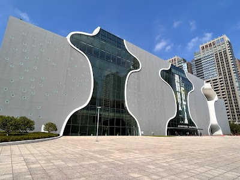
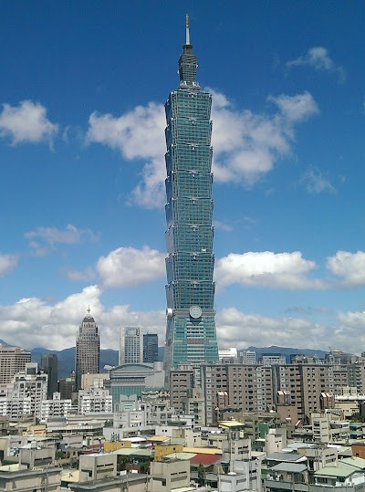
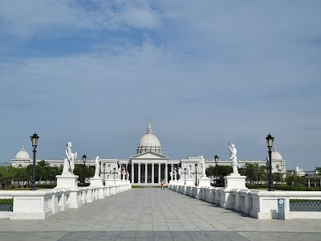
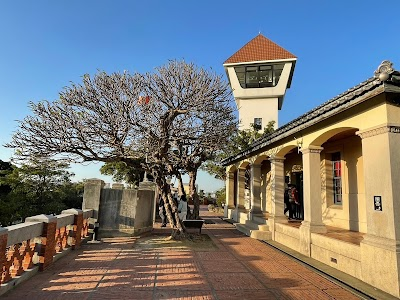
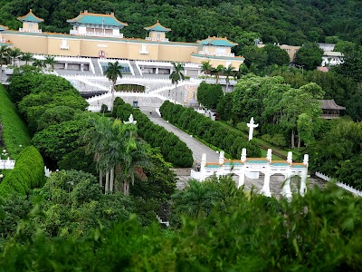
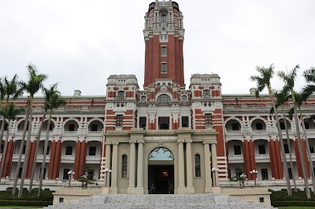

## Image: 中正紀念堂.jpg

### Question: 請問圖片中是台灣哪一個景點

Answer: [INST] <image> 
請問圖片中是台灣哪一個景點 [/INST] 這張圖片是台灣的一個著名的景點，它是台灣的國立故宮博物館（National Palace Museum）。這個博物館是台灣的一個重要的文化和历史地標，位於台北市中正區。它是中國的一個最大的博物館之一，擁有超過7000件的古蔑和文

### Question: 請問圖片中是哪一個景點

Answer: [INST] <image> 
請問圖片中是哪一個景點 [/INST] 這張圖片中的景點是中國的一個著名的古蹟——天壇門。天壇門是中國古代建築的一座重要的文化遗产，位于北京市中关门区。它是中国古代建築的代表性的一座建筑，是中国古代建筑的一种典型

---

## Image: 八卦山大佛.jpg

### Question: 請問圖片中是台灣哪一個景點

Answer: [INST] <image> 
請問圖片中是台灣哪一個景點 [/INST] 這張圖片中的大佛是台灣的一個著名的景點，位於台北市中正區的大佛寺。大佛寺是台灣最著名的佛教寺廟之一，是台灣最大的佛教大佛之一，也是台灣最著名的旅遊景點之一。 </s>

### Question: 請問圖片中是哪一個景點

Answer: [INST] <image> 
請問圖片中是哪一個景點 [/INST] 這張圖片中的景點是大佛寺。大佛寺是一個著名的佛教寺廟，位於台灣台北市中正區。大佛寺的主要特色是一個巨大的大佛，它是一個廣觀的佛像，代表著佛教的信仰和文化。大佛寺是台灣最著名的佛教寺�

---

## Image: 台中國家歌劇院.jpg

### Question: 請問圖片中是台灣哪一個景點

Answer: [INST] <image> 
請問圖片中是台灣哪一個景點 [/INST] 這張圖片中的建築是台灣的一個著名的建築之一，名為「國立台灣博物館」。這個建築位於台北市中正區，是台灣最大的博物館之一，也是台灣最著名的博物館之一。它的設計非常卓越，被譽為「世界最

### Question: 請問圖片中是哪一個景點

Answer: [INST] <image> 
請問圖片中是哪一個景點 [/INST] 這張圖片中的建築物是「萬年藝術博物館」（Museum），位於台灣台北市中正區。這個建築物是由萬年藝術博物館設計的，並且是台灣最大的藝術博物館之一。建築物的設計非常創新，具

---

## Image: 台北101.jpg

### Question: 請問圖片中是台灣哪一個景點

Answer: [INST] <image> 
請問圖片中是台灣哪一個景點 [/INST] 這張圖片中的建築物是台灣台北市的一座著名的塔式建築物，稱為台北101大樓。這座建築物是台灣最高的建築物之一，並且是台灣的一個重要的觀點和旅遊景點。 </s>

### Question: 請問圖片中是哪一個景點

Answer: [INST] <image> 
請問圖片中是哪一個景點 [/INST] 這張圖片中的景點是台灣的台北101大樓。這是一座高度的建築大樓，位於台北市中心區，是台灣最高的建築物件之一。它的設計風格是現代化的，並且具有一個高度的塔樓，這個塔樓是台灣的一

---

## Image: 台南赤崁樓.jpg

### Question: 請問圖片中是台灣哪一個景點

Answer: [INST] <image> 
請問圖片中是台灣哪一個景點 [/INST] 這張圖片中的建築是台灣的一個著名的景點，它是台灣的國立故宮博物館（National Palace Museum）。這個博物館位於台北市，是台灣最大的博物館之一，是台灣文化的重要資源之一。 </s>

### Question: 請問圖片中是哪一個景點

Answer: [INST] <image> 
請問圖片中是哪一個景點 [/INST] 這張圖片中的景點是中國的一個古老的寺廟，具體是中國古蹟名為「天壇寺」。這個寺廟是中國古建築的代表性的建築，位於中國的山西省，是中國古建築的重要保護和研究對象之一。 </s>

---

## Image: 國父紀念館.jpg

### Question: 請問圖片中是台灣哪一個景點

Answer: [INST] <image> 
請問圖片中是台灣哪一個景點 [/INST] 這張圖片中的建築是台灣的一個著名的景點，它是台灣的國立故宮博物館（National Palace Museum）。這個建築是台灣的一個重要的文化和历史地標，是台灣的一個著名的博物館，擁有世界上最大的中國古代文物藏藏。 </s>

### Question: 請問圖片中是哪一個景點

Answer: [INST] <image> 
請問圖片中是哪一個景點 [/INST] 這張圖片中的景點是中國的一座古老的建築，稱為「天壇門」（Tiananmen）。這座建築是中國的政治中心，位於北京市中心。它是中國的重要文化和政治地標之一，也是中國的國家公共廳所在的地方。 </s>

---

## Image: 奇美博物館.jpg

### Question: 請問圖片中是台灣哪一個景點

Answer: [INST] <image> 
請問圖片中是台灣哪一個景點 [/INST] 這張圖片中的建築是台灣的立體國會大廳（National Assembly Hall）。這是台灣政府的重要建築，位於台北市中正區。它是台灣最大的立體建築之一，也是台灣政府的重要機構之一。 </s>

### Question: 請問圖片中是哪一個景點

Answer: [INST] <image> 
請問圖片中是哪一個景點 [/INST] 這張圖片中的景點是印度大學（Indian Institute of Technology, IIT）的校園。特別是這裡的大學堂（IIT Main Building），這是印度大學的主要校園建築物之一，也是印度大學的校園中最重要的建築物之一。這個建築物的設計風格是印度

---

## Image: 安平古堡.jpg

### Question: 請問圖片中是台灣哪一個景點

Answer: [INST] <image> 
請問圖片中是台灣哪一個景點 [/INST] 這張圖片中的景點是台灣的一個著名的古蹟——淡淡古城。淡淡古城是台灣最古的城堡之一，位於台北市中心區，是台灣最著名的古城之一。它是台灣最古的城堡之一，是台灣最著名的古城之一。

### Question: 請問圖片中是哪一個景點

Answer: [INST] <image> 
請問圖片中是哪一個景點 [/INST] 這張圖片中的景點是一個古老的城堡，可能是一個古老的城堡或者古老的城堡附近的建築物。城堡通常是一個古老的城市的重要建築，通常是用石或石頭製造的，並且通常有一個高塔，用於����

---

## Image: 故宮.jpg

### Question: 請問圖片中是台灣哪一個景點

Answer: [INST] <image> 
請問圖片中是台灣哪一個景點 [/INST] 這張圖片是台灣的一個著名的景點，它是台灣最大的佛教寺廟——金閣寺廟。金閣寺廟位於台北市，是台灣最著名的旅遊景點之一，每年都會有大量的觀客前來觀賞。 </s>

### Question: 請問圖片中是哪一個景點

Answer: [INST] <image> 
請問圖片中是哪一個景點 [/INST] 這張圖片顯示的是一個豐富的景點，可能是一個古老的建築，可能是一個寺廟或者一個古老的城堡。建築上有一些綠色的樹木和綠色的草，並且有一些白色的建築，可能是一個廣場

---

## Image: 總統府.jpg

### Question: 請問圖片中是台灣哪一個景點

Answer: [INST] <image> 
請問圖片中是台灣哪一個景點 [/INST] 這張圖片是台灣的一個著名的建築作品，名為「國立台灣大學」。這個建築作品是台灣最大的大學之一，位於台北市中正區。它的設計風格是萬年代的歐洲建築風格，具有豐富的藝術和建築

### Question: 請問圖片中是哪一個景點

Answer: [INST] <image> 
請問圖片中是哪一個景點 [/INST] 這是一個名為 "Raffles Hotel" 的建築物，位於新加坡。這是一個著名的酒店，是新加坡的一個重要的文化和旅遊景點。 </s>

---

